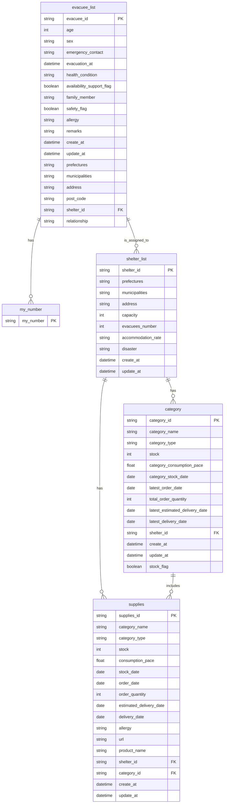

```mermaid
erDiagram
    evacuee_list ||--o{ my_number : has
    evacuee_list ||--o{ shelter_list : is_assigned_to
    shelter_list ||--o{ category : has
    shelter_list ||--o{ supplies : has
    category ||--o{ supplies : includes

    evacuee_list {
        string evacuee_id PK
        int age
        string sex
        string emergency_contact
        datetime evacuation_at
        string health_condition
        boolean availability_support_flag
        string family_member
        boolean safety_flag
        string allergy
        string remarks
        datetime create_at
        datetime update_at
        string prefectures
        string municipalities
        string address
        string post_code
        string shelter_id FK
        string relationship
    }

    my_number {
        string my_number PK
    }

    shelter_list {
        string shelter_id PK
        string prefectures
        string municipalities
        string address
        int capacity
        int evacuees_number
        string accommodation_rate
        string disaster
        datetime create_at
        datetime update_at
    }

    category {
        string category_id PK
        string category_name
        string category_type
        int stock
        float category_consumption_pace
        date category_stock_date
        date latest_order_date
        int total_order_quantity
        date latest_estimated_delivery_date
        date latest_delivery_date
        string shelter_id FK
        datetime create_at
        datetime update_at
        boolean stock_flag
    }

    supplies {
        string supplies_id PK
        string category_name
        string category_type
        int stock
        float consumption_pace
        date stock_date
        date order_date
        int order_quantity
        date estimated_delivery_date
        date delivery_date
        string allergy
        string url
        string product_name
        string shelter_id FK
        string category_id FK
        datetime create_at
        datetime update_at
    }
```
