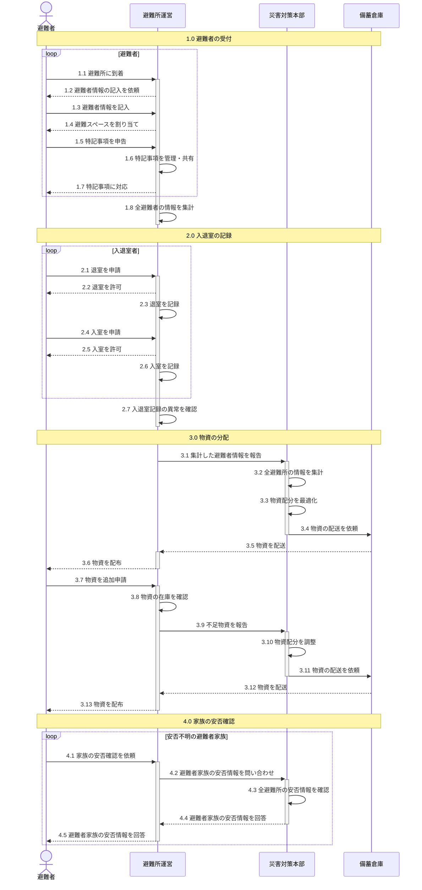
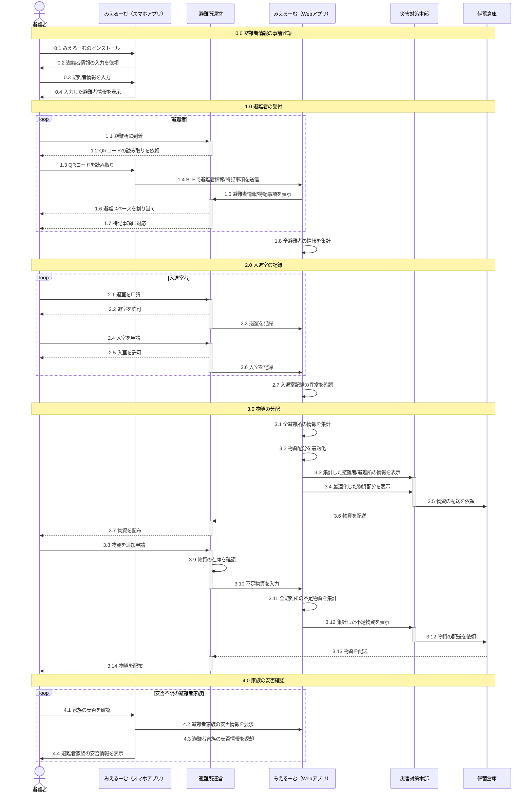

## As-Isモデル

```mermaid
sequenceDiagram
actor citizen as 避難者
participant shelter as 避難所運営
participant headquarters as 災害対策本部
participant warehouse as 備蓄倉庫

Note over citizen, warehouse: 1.0 避難者の受付
loop 避難者
  citizen->>+shelter: 1.1 避難所に到着
  shelter-->>citizen: 1.2 避難者情報の記入を依頼
  citizen->>shelter: 1.3 避難者情報を記入
  shelter-->>citizen: 1.4 避難スペースを割り当て
  citizen->>shelter: 1.5 特記事項を申告
  shelter->>shelter: 1.6 特記事項を管理・共有
  shelter-->>citizen: 1.7 特記事項に対応
end
shelter->>-shelter: 1.8 全避難者の情報を集計

Note over citizen, warehouse: 2.0 入退室の記録
loop 入退室者
  citizen->>+shelter: 2.1 退室を申請
  shelter-->>citizen: 2.2 退室を許可
  shelter->>shelter: 2.3 退室を記録
  citizen->>shelter: 2.4 入室を申請
  shelter-->>citizen: 2.5 入室を許可
  shelter->>shelter: 2.6 入室を記録
end
shelter->>-shelter: 2.7 入退室記録の異常を確認

Note over citizen, warehouse: 3.0 物資の分配
shelter->>+headquarters: 3.1 集計した避難者情報を報告
headquarters->>headquarters: 3.2 全避難所の情報を集計
headquarters->>headquarters: 3.3 物資配分を最適化
headquarters->>-warehouse: 3.4 物資の配送を依頼
warehouse-->>+shelter: 3.5 物資を配送
shelter-->>-citizen: 3.6 物資を配布
citizen->>+shelter: 3.7 物資を追加申請
shelter->>shelter: 3.8 物資の在庫を確認
shelter->>+headquarters: 3.9 不足物資を報告
headquarters->>headquarters: 3.10 物資配分を調整
headquarters->>-warehouse: 3.11 物資の配送を依頼
warehouse-->>shelter: 3.12 物資を配送
shelter-->>-citizen: 3.13 物資を配布

Note over citizen, warehouse: 4.0 家族の安否確認
loop 安否不明の避難者家族
  citizen->>+shelter: 4.1 家族の安否確認を依頼
  shelter->>+headquarters: 4.2 避難者家族の安否情報を問い合わせ
  headquarters->>headquarters: 4.3 全避難所の安否情報を確認
  headquarters-->>-shelter: 4.4 避難者家族の安否情報を回答
  shelter-->>-citizen: 4.5 避難者家族の安否情報を回答
end

```

## To-Beモデル

```mermaid
sequenceDiagram
actor citizen as 避難者
participant mobile as みえるーむ（スマホアプリ）
participant shelter as 避難所運営
participant web as みえるーむ（Webアプリ）
participant headquarters as 災害対策本部
participant warehouse as 備蓄倉庫

Note over citizen, warehouse: 0.0 避難者情報の事前登録
citizen->>mobile: 0.1 みえるーむのインストール
mobile-->>citizen: 0.2 避難者情報の入力を依頼
citizen->>mobile: 0.3 避難者情報を入力
mobile-->>citizen: 0.4 入力した避難者情報を表示

Note over citizen, warehouse: 1.0 避難者の受付
loop 避難者
  citizen->>+shelter: 1.1 避難所に到着
  shelter-->>-citizen: 1.2 QRコードの読み取りを依頼
  citizen->>mobile: 1.3 QRコードを読み取り
  mobile->>web: 1.4 BLEで避難者情報/特記事項を送信
  web->>+shelter: 1.5 避難者情報/特記事項を表示
  shelter-->>citizen: 1.6 避難スペースを割り当て
  shelter-->>-citizen: 1.7 特記事項に対応
end
web->>web: 1.8 全避難者の情報を集計

Note over citizen, warehouse: 2.0 入退室の記録
loop 入退室者
  citizen->>+shelter: 2.1 退室を申請
  shelter-->>citizen: 2.2 退室を許可
  shelter->>-web: 2.3 退室を記録
  citizen->>+shelter: 2.4 入室を申請
  shelter-->>citizen: 2.5 入室を許可
  shelter->>-web: 2.6 入室を記録
end
web->>web: 2.7 入退室記録の異常を確認

Note over citizen, warehouse: 3.0 物資の分配
web->>web: 3.1 全避難所の情報を集計
web->>web: 3.2 物資配分を最適化
web->>+headquarters: 3.3 集計した避難者/避難所の情報を表示
web->>headquarters: 3.4 最適化した物資配分を表示
headquarters->>-warehouse: 3.5 物資の配送を依頼
warehouse-->>+shelter: 3.6 物資を配送
shelter-->>-citizen: 3.7 物資を配布
citizen->>+shelter: 3.8 物資を追加申請
shelter->>shelter: 3.9 物資の在庫を確認
shelter->>-web: 3.10 不足物資を入力
web->>web: 3.11 全避難所の不足物資を集計
web->>+headquarters: 3.12 集計した不足物資を表示
headquarters->>-warehouse: 3.12 物資の配送を依頼
warehouse-->>+shelter: 3.13 物資を配送
shelter-->>-citizen: 3.14 物資を配布

Note over citizen, warehouse: 4.0 家族の安否確認
loop 安否不明の避難者家族
  citizen->>mobile: 4.1 家族の安否を確認
  mobile->>web:  4.2 避難者家族の安否情報を要求
  web-->mobile: 4.3 避難者家族の安否情報を返却
  mobile->>citizen: 4.4 避難者家族の安否情報を表示
end

```
