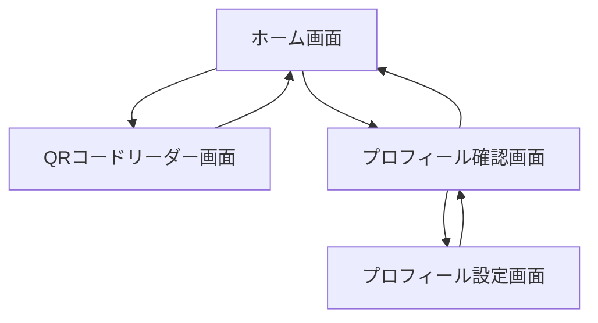

## 画面フロー



## 機能一覧

### 基本機能

- ホーム機能
    - 現在の状態（避難所にいるか否か）が表示される。
    - 自分の安否情報を設定できる。
    - 家族の安否情報が表示される。
    
    ```mermaid
    sequenceDiagram
        actor evacuees as 避難者
        participant mobile as モバイルアプリ
        participant storage as ローカルストレージ
        participant web as Webアプリ
    
        evacuees->>mobile: アプリを開く
        mobile->>storage: 現在の状態を取得
        storage-->>mobile: 状態データ
        mobile->>storage: 自分の安否情報を取得
        storage-->>mobile: 安否情報
        mobile->>storage: 家族の安否情報を取得
        storage-->>mobile: 家族の安否情報
        mobile-->>evacuees: 情報を表示
    
        opt インターネット接続がある場合
            mobile->>web: 最新の家族の安否情報を要求
            web-->>mobile: 更新された家族の安否情報
            mobile->>storage: 更新情報を保存
            mobile-->>evacuees: 更新された情報を表示
        end
    
        opt 安否情報を更新
            evacuees->>mobile: 新しい安否情報を入力
            mobile->>storage: 新しい安否情報を保存
            opt インターネット接続がある場合
                mobile->>web: 新しい安否情報を送信
                web-->>mobile: 更新完了通知
            end
            mobile-->>evacuees: 更新完了を表示
        end
    ```
    

### プロフィール機能

- プロフィール確認機能
    - 自分のマイナンバーが表示されている。
    - 家族のマイナンバーが表示されている。
    - 自分の特記事項（要配慮事項）が表示されている。
    - プロフィール設定画面に遷移できる。
    - プロフィールを削除できる。
    
    ```mermaid
    sequenceDiagram
        actor evacuees as 避難者
        participant mobile as モバイルアプリ
        participant storage as ローカルストレージ
    
        evacuees->>mobile: プロフィール確認画面を開く
        mobile->>storage: プロフィール情報を取得
        storage-->>mobile: プロフィールデータ
        mobile-->>evacuees: プロフィール情報を表示
    
        alt プロフィール編集
            evacuees->>mobile: 編集ボタンをタップ
            mobile-->>evacuees: プロフィール設定画面を表示
        else プロフィール削除
            evacuees->>mobile: 削除ボタンをタップ
            mobile-->>evacuees: 削除確認を表示
            evacuees->>mobile: 削除を確認
            mobile->>storage: プロフィールを削除
            mobile-->>evacuees: プロフィール設定画面に遷移
        end
    ```
    
- プロフィール設定機能
    - 自分のマイナンバーを入力できる。
    - 家族のマイナンバーを複数入力できる。
    - 自分の特記事項（要配慮事項）を入力できる。
    - プロフィールの設定を完了できる。
    - プロフィールの設定を中止できる。
    
    ```mermaid
    sequenceDiagram
        actor evacuees as 避難者
        participant mobile as モバイルアプリ
        participant storage as ローカルストレージ
        participant web as Webアプリ
    
        evacuees->>mobile: プロフィール設定画面を開く
        
        alt 既存のプロフィールがある場合
            mobile->>storage: 既存のプロフィール情報を取得
            storage-->>mobile: プロフィールデータ
            mobile-->>evacuees: 既存の情報を表示
        end
    
        evacuees->>mobile: マイナンバーを入力
        evacuees->>mobile: 家族のマイナンバーを入力
        evacuees->>mobile: 特記事項を入力
        evacuees->>mobile: 設定完了ボタンをタップ
        mobile-->>evacuees: 設定内容の確認を表示
        evacuees->>mobile: 設定を確認
        mobile->>storage: 新しいプロフィール情報を保存
        
        alt インターネット接続がある場合
            mobile->>web: 新しいプロフィール情報を保存
            web-->>mobile: 保存の成功通知
        end
        
        mobile-->>evacuees: 設定完了を表示
        mobile-->>evacuees: ホーム画面に遷移
    
        alt 設定中止
            evacuees->>mobile: 中止ボタンをタップ
            mobile-->>evacuees: 中止確認を表示
            evacuees->>mobile: 中止を確認
            mobile-->>evacuees: ホーム画面に遷移
        end
    ```
    
- プロフィール送信機能
    - カメラアプリでQRコードを読み込み後、アプリが起動する。
    - アプリ起動後、WebアプリとのBLE接続が確立される。
    - BLE接続後、プロフィールがサーバーに送信される。
    
    ```mermaid
    sequenceDiagram
        actor evacuees as 避難者
        participant mobile as モバイルアプリ
        participant storage as ローカルストレージ
        participant web as Webアプリ
    
        evacuees->>evacuees: カメラアプリを起動
        evacuees->>mobile: QRコードをスキャン
        mobile->>mobile: アプリが起動
        mobile->>mobile: QRコードを解析
        mobile->>storage: プロフィール情報を取得
        storage-->>mobile: プロフィールデータ
        mobile->>web: プロフィール情報を送信
        web-->>mobile: 送信の成功を通知
        mobile-->>evacuees: ホーム画面を表示
    ```
