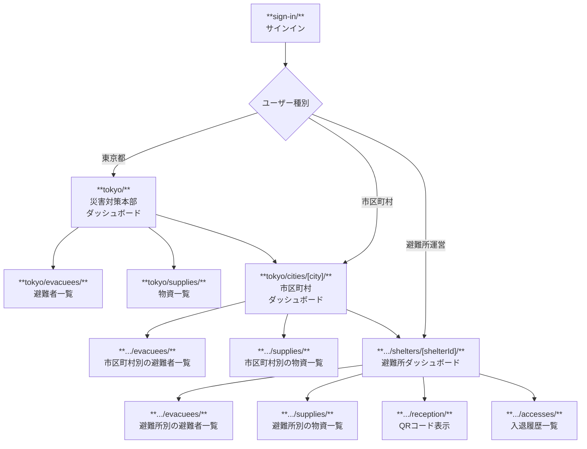

```mermaid
graph TD
    sign-in["**sign-in/**<br>サインイン"] --> user{"ユーザー種別"}

    user -->|東京都| head["**tokyo/**<br>災害対策本部<br>ダッシュボード"]
    head --> head-evacuees["**tokyo/evacuees/**<br>避難者一覧"]
    head --> head-supplies["**tokyo/supplies/**<br>物資一覧"]
    head --> city

    user -->|市区町村| city["**tokyo/cities/[city]/**<br>市区町村<br>ダッシュボード"]
    city --> city-evacuees["**.../evacuees/**<br>市区町村別の避難者一覧"]
    city --> city-supplies["**.../supplies/**<br>市区町村別の物資一覧"]
    city --> shelter

    user -->|避難所運営| shelter["**.../shelters/[shelterId]/**<br>避難所ダッシュボード"]
    shelter --> shelter-evacuees["**.../evacuees/**<br>避難所別の避難者一覧"]
    shelter --> shelter-supplies["**.../supplies/**<br>避難所別の物資一覧"]
    shelter --> reception["**.../reception/**<br>QRコード表示"]
    shelter --> access["**.../accesses/**<br>入退履歴一覧"]
```
