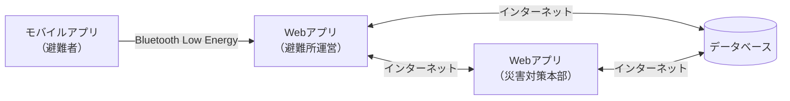

## 1. はじめに

### 1.1 プロジェクト概要

「みえるーむ」は、オフライン環境下でも機能する革新的な避難所管理システムです。本システムは、大規模災害発生時における市民動態の可視化および避難所運営を効果的に支援することを目的としています。

### 1.2 目的

本プロジェクトの主な目的は以下の通りです：

- インターネット不通時の情報共有問題の解決
- 避難所状況のリアルタイム把握
- 避難者管理と資源配分の効率化
- 要配慮者への迅速な支援提供
- 家族・知人の安否確認の迅速化

## 2. 機能要件

### 2.1 避難者管理機能

- QRコードによる避難者チェックイン
- 避難者情報の登録、更新、削除
- 避難者の入退室管理
- 要配慮者の識別と特別対応

### 2.2 データ同期機能

- Bluetooth Low Energy (BLE) を活用したオフラインデータ同期
- 避難所間でのデータ共有
- 災害対策本部とのデータ同期

### 2.3 可視化機能

- リアルタイムビジュアライゼーションダッシュボード
- 避難所ごとの状況表示
- 全体的な避難状況の俯瞰表示

### 2.4 物資管理機能

- 物資の在庫管理
- 物資配分の最適化
- 不足物資のアラート機能

### 2.5 安否確認機能

- 家族・知人の安否確認システム
- 避難者の避難先管理

## 4. システム構成

### 4.1 クライアントアプリケーション

- モバイルアプリ：避難者用
- Webアプリ：避難所運営・災害対策本部用

### 4.2 通信プロトコル

- HTTPS（Webアプリ同士の通信）
- Bluetooth Low Energy（モバイルアプリ-Webアプリ間の通信）
